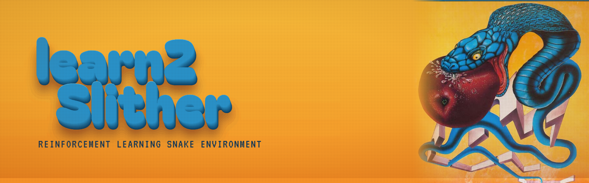
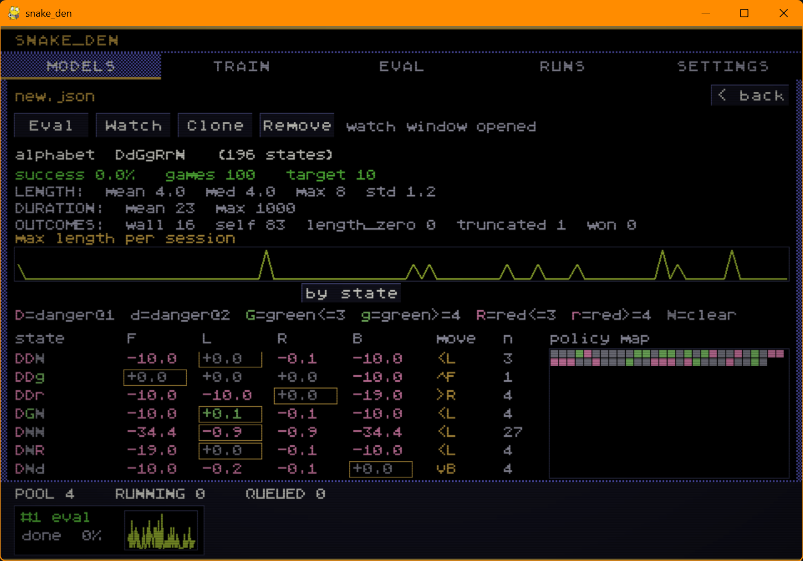
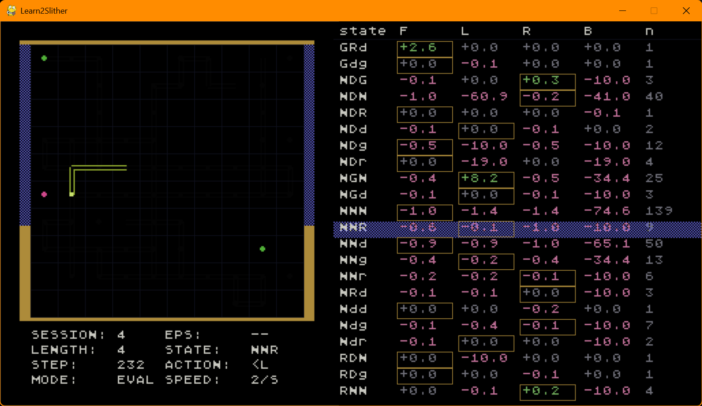

<p align="center">
  
</p>

# learn2Slither

`learn2Slither` is a reinforcement-learning Snake environment built around a
tabular Q-learning agent. It includes a headless command-line trainer, an
interactive Pygame visualizer, JSON model persistence, evaluation reports, and
`snake_den`, a Pygame hub for launching, comparing, and inspecting experiments.

The snake learns from scratch: it sees only four lines of vision from its head,
chooses one of four moves, and is shaped by rewards into reaching length ≥ 10
and surviving as long as possible. Nothing about the board is hard-coded into
the policy — everything is learned into a Q-table.

The project is intentionally small in dependencies: the runtime uses
`pygame-ce`, while development adds `pytest` and `flake8`.

## Features

- Tabular Q-learning agent with epsilon-greedy exploration.
- Configurable Snake board, reward values, learning parameters, and state
  alphabet.
- Headless training and evaluation for fast batch runs.
- Optional visual mode showing the board, current state, action, and Q-table.
- Model save/load as human-readable JSON.
- Reproducible seeded runs and model comparison against a random baseline.
- `snake_den` experiment hub with model, training, evaluation, run-history, and
  settings screens.
- JSON-lines progress mode used by the hub to track live training jobs.

## How It Works

The architecture follows the classic RL loop, split into independent modules so
each can be evaluated on its own:

```text
Environment --> Interpreter --> (State + Reward) --> Agent --> Action --> Environment
```

- **Environment** owns the 10×10 board, the snake, and the apples, and applies
  the rules (green apple grows the snake, red apple shrinks it, walls / self /
  zero length end the game).
- **Interpreter** is the agent's only window onto the world. It reads the four
  rays of vision from the snake's head — up, down, left, right, each running all
  the way to the wall — and compresses them into a small **state key**, and it
  computes the **reward** for the last move. The agent never touches the board
  directly, so it can never use information beyond its vision.
- **Agent** keeps the Q-table and learns with the Bellman update, choosing moves
  epsilon-greedily (explore early, exploit later as epsilon decays).

The state representation exploits the board's symmetry: the three relative
directions (forward / left / right) are each reduced to a single nearest-object
symbol, and the frame is canonicalized so symmetric situations share one entry.
This keeps the Q-table tiny and learnable. Which perceptual distinctions are
encoded is configurable (see `-state` and the `[state]` config section).

## Screenshots

`slither` in visual mode: the cabinet board on the left (snake, green and red
apples, live HUD with session / length / step / state / action) and the full
Q-table on the right, one row per state, with the snake's current state
highlighted.

<p align="center">
  
</p>

`snake_den`, the experiment hub (Models tab): a registered model's success rate,
outcome breakdown, training curve, per-state Q-values, and policy map, with the
background job pool at the bottom.

<p align="center">
  
</p>

## Project Layout

```text
.
|-- configs/              # Default TOML configuration
|-- docs/                 # README screenshots
|-- models/               # Saved model JSON files
|-- slither/              # Core environment, agent, CLI, runner, evaluator
|-- snake_den/            # Pygame experiment hub
|-- tests/                # Unit and smoke tests
|-- snake                 # Unix-style CLI launcher for slither
|-- hub                   # Unix-style launcher for snake_den
`-- learn2Slither_banner.png
```

## Requirements

- Python 3.11 or newer (the config loader uses the stdlib `tomllib`)
- `pygame-ce`

Install runtime dependencies:

```bash
python -m pip install -r requirements.txt
```

For development and tests:

```bash
python -m pip install -r requirements-dev.txt
```

## Quick Start

Run one headless game:

```bash
python -m slither -sessions 1
```

Train for 500 sessions and save the learned model:

```bash
python -m slither -sessions 500 -save models/trained.json -seed 42 -stats
```

Resume training from a saved model:

```bash
python -m slither -sessions 500 -load models/trained.json -save models/trained.json
```

Watch the agent play in a Pygame window:

```bash
python -m slither -load models/trained.json -visual on -dontlearn
```

On Unix-like systems, the included launchers are equivalent:

```bash
./snake -sessions 500 -save models/trained.json
./hub
```

## CLI Usage

The main CLI is exposed through `python -m slither`.

Common flags:

| Flag | Description |
| --- | --- |
| `-sessions N` | Number of games to run. |
| `-save PATH` | Save the model after the run. |
| `-load PATH` | Load a model before the run. |
| `-visual on/off` | Open the Pygame visualizer. Defaults to `off`. |
| `-dontlearn` | Disable learning and use greedy evaluation mode. |
| `-step-by-step` | Advance one move at a time (Enter in the terminal, Space in the GUI). |
| `-stats` | Print an aggregate report after the run. |
| `-seed N` | Seed the RNG for reproducible runs. |
| `-config PATH` | Load a TOML config file. |
| `-state SPEC` | Select the state alphabet. Use `default` or a comma list of distinctions among `warn,caution,green_far,red_far,body_far`. |
| `-compare PATH...` | Compare one or more saved models against the random baseline. |
| `-progress` | Emit JSON-lines progress for the hub. |

Compare models with the same seeded greedy evaluation suite:

```bash
python -m slither -compare models/a.json models/b.json -seed 0
```

Run an evaluation report for one frozen model:

```bash
python -m slither -load models/trained.json -dontlearn -sessions 100 -stats -seed 0
```

### Demonstrating learning

Because evaluation is fully seeded, you can show the policy improving with
training by comparing models trained for different numbers of sessions against a
random-action baseline on the identical greedy suite:

```bash
python -m slither -compare models/random.json models/s1.json models/s10.json models/s100.json -seed 0
```

The printed learning-curve table reports success rate (length ≥ 10) and survival
for each model, so more training should beat fewer sessions, and any trained
model should beat random.

## snake_den Hub

`snake_den` is the visual experiment cockpit. It launches `slither` runs in the
background, tracks progress, registers completed models, records evaluation
scores, and keeps run history in `snake_den/hub_data.json`.

Start it with:

```bash
python -m snake_den
```

The hub includes tabs for:

- `Models`: browse saved models, policy summaries, scores, and Q-table data.
- `Train`: configure and launch training runs.
- `Eval`: run frozen-model evaluation suites.
- `Runs`: inspect recent training and evaluation jobs.
- `Settings`: adjust persisted hub preferences.

## Configuration

Defaults live in `configs/default.toml`. CLI flags override config values where
applicable.

The main sections are:

- `[board]`: board size, apple counts, initial snake length.
- `[goal]`: target length used for success metrics.
- `[state]`: perceptual distinctions used to build state keys.
- `[rewards]`: reward shaping for apples, movement, death, and wins.
- `[exploration]`: epsilon-greedy schedule.
- `[learning]`: alpha and gamma settings.
- `[evaluation]`: suite size and step cap.
- `[gui]`: visualizer cell size and speed.

Use a custom config:

```bash
python -m slither -config configs/default.toml -sessions 100
```

## Model Files

Models are saved as JSON. A model stores:

- Q-values and visit counts.
- Number of training sessions completed.
- The effective state alphabet used by the model.
- A copy of the config for traceability.
- A compact training curve for UI display.

This makes models easy to inspect, diff, commit, and resume. The state alphabet
travels with the model, so a loaded model plays under the alphabet it was
trained with.

## Development

Run the test suite from the repository root:

```bash
python -m pytest
```

Run linting:

```bash
python -m flake8
```

The test suite is structured so headless logic does not import Pygame unless a
visual path is explicitly exercised.
